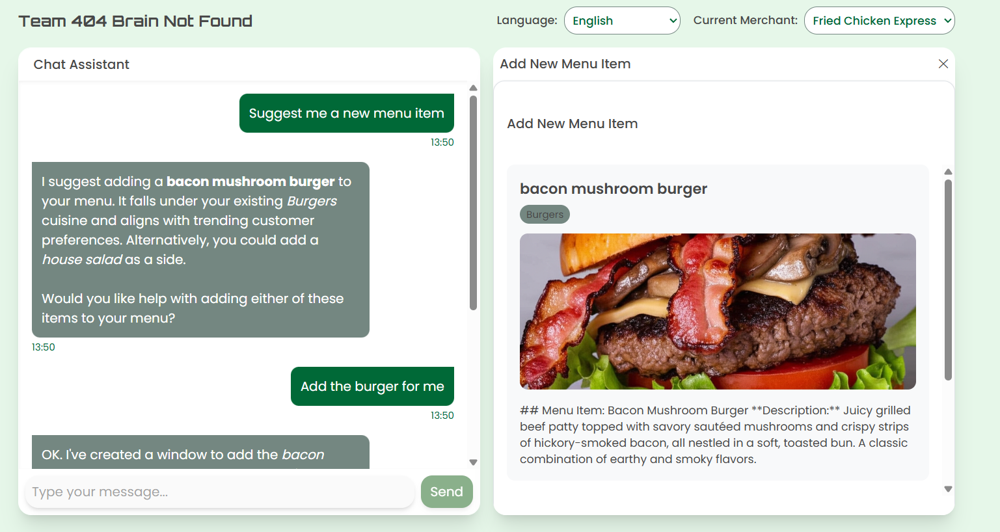
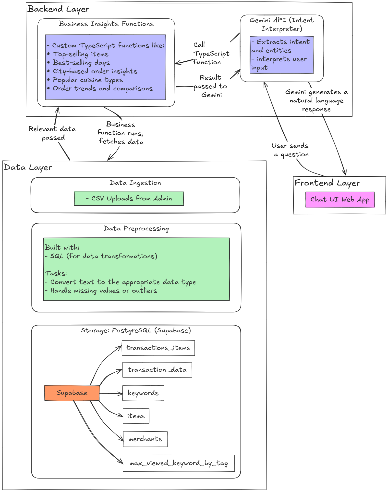

# Chappy - MEX Assistant for UMHackathon

## Quick Links
- **[Presentation Slides](#link-here)**: Pitching slides
- **[Figma Design](#link-here)**: Figma prototype containing more features
- **[Live Demo](https://umhackathon.vercel.app/)**: Check out our live demo!



Chappy is our submission for UMHackathon Domain 3 Task 2: MEX Assistant – Insights. It provides an AI-powered assistant for Grab Food merchants, helping them understand business performance, optimize operations, and manage their menu items through a conversational interface.

Our solution is designed to meet the key evaluation criteria:
- **Insight Quality and Relevance:** Providing actionable, prioritized insights
- **Communication Effectiveness:** Explaining complex data in simple terms with visual support
- **User Experience and Engagement:** Creating natural conversation flows with quick response times

## Features

- **AI-Powered Chat Assistant**: Built with Gemini AI for natural language interactions
- **Multi-Language Support**: Automatically detects and adapts to user language
- **Interactive Data Visualization**: Dynamic charts and graphs for business analytics
- **Menu Item Management**: Create and preview new menu items with AI-generated descriptions and images
- **Merchant Selector**: Switch between different merchant accounts
- **Responsive Design**: Adaptive grid layout for different screen sizes

## How It Works

### Intent Recognition and Function Calling

Chappy uses Google's Gemini AI to understand merchant queries and determine their intent. Based on the detected intent, the system will:

1. **Call appropriate functions** to retrieve relevant business data (e.g., sales trends, peak hours, top-selling items)
2. **Process and analyze data** to extract meaningful insights
3. **Generate visualizations** that help merchants understand the data at a glance
4. **Provide actionable recommendations** based on the analyzed data

For example, when a merchant asks about their sales performance, Gemini will:
- Identify this as a sales analysis request
- Call functions to retrieve historical sales data
- Generate charts showing trends and patterns
- Highlight key insights such as peak selling times or best-performing items

### Menu Item Management

Merchants can add new menu items through a conversational interface:
- Simply describe the new item to Chappy
- Gemini will extract relevant details and format them appropriately
- AI-generated descriptions and images are created based on the item details
- Merchants can preview and confirm before the item is added to their menu

## Architecture



The application follows a modern, serverless architecture with:
- Next.js App Router for frontend and API routes
- Google Gemini AI for natural language processing and function calling
- Supabase for data storage and retrieval
- Serverless functions for handling business logic

## Tech Stack

- **Framework**: Next.js 15 with App Router
- **UI**: React 19, Tailwind CSS 4
- **AI Integration**: Google Gemini AI API (@google/genai)
- **Data Storage**: Supabase
- **Charts**: Recharts, shadcn/ui
- **Styling**: Tailwind CSS, Class Variance Authority, CLSX
- **Animation**: Motion

## Getting Started

### Environment Setup

Create a `.env.local` file in the root directory with the following variables:
```
GEMINI_API_KEY=your_gemini_api_key
NEXT_PUBLIC_SUPABASE_URL=your_supabase_url
NEXT_PUBLIC_SUPABASE_ANON_KEY=your_supabase_anon_key
```

### Installation

```bash
# Install dependencies
pnpm install

# Run the development server with Turbopack
pnpm dev
```

Open [http://localhost:3000](http://localhost:3000) with your browser to see the application.

## Project Structure

- `app/` - Next.js App Router structure
  - `api/` - API routes for chat, images, and merchant settings
  - `components/` - React components for UI elements
  - `contexts/` - React contexts for state management
  - `gemini/` - Configuration and functionality for Gemini AI
  - `hooks/` - Custom React hooks
  - `lib/` - Utility functions and services
  - `types/` - TypeScript type definitions

## Key Features

### Chat Interface

The chat interface allows merchants to ask questions about their business performance, get insights, and receive actionable recommendations.

### Data Visualization

Dynamic data windows display charts, graphs, and statistics based on the conversation context, providing visual representation of business metrics.

### Menu Item Creation

Merchants can create new menu items through the chat interface, with AI-generated descriptions and images based on the item name and cuisine type.

### Multi-Language Support

The application automatically detects the user's language and can switch the interface language to provide a seamless experience.

## Team

Created by Team 404 Brain Not Found
